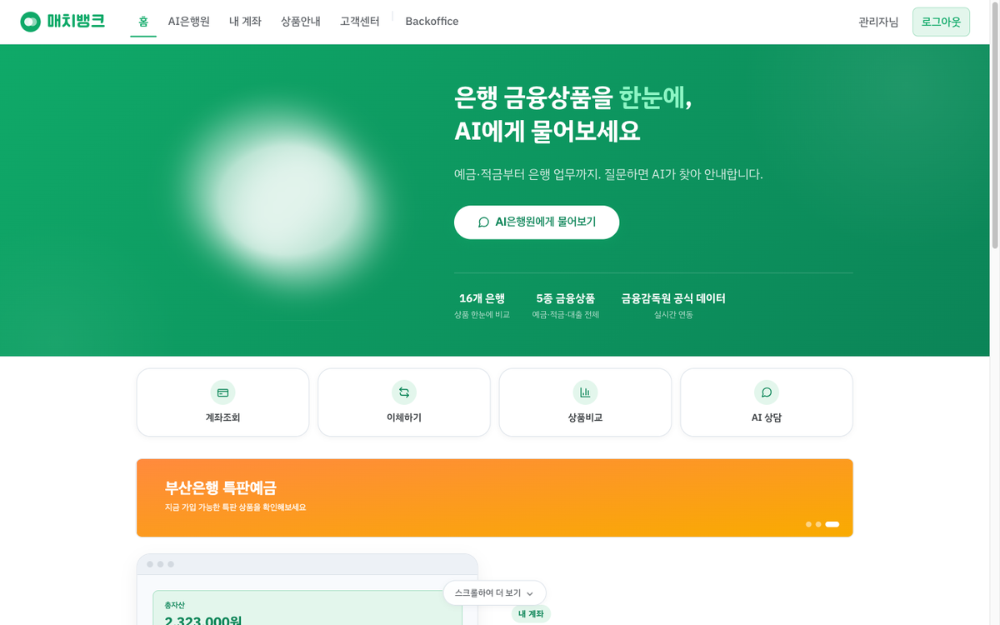
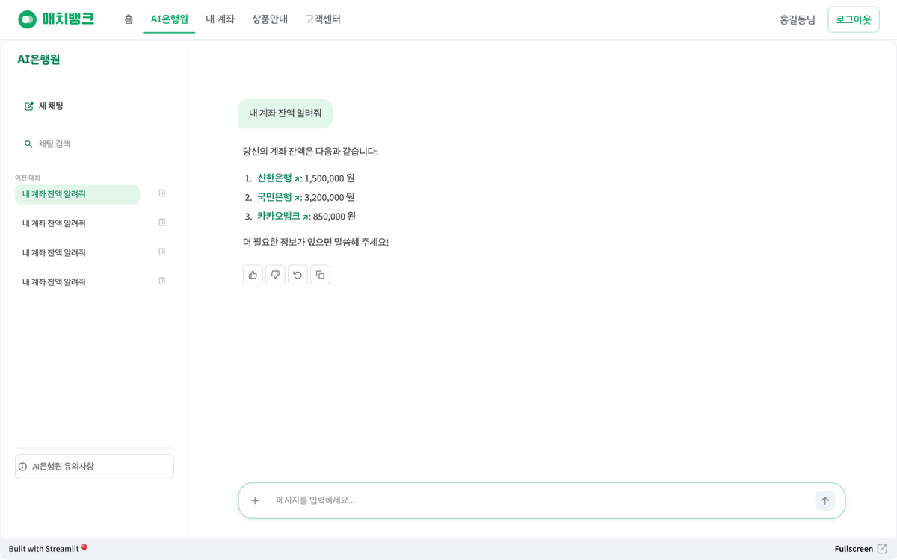
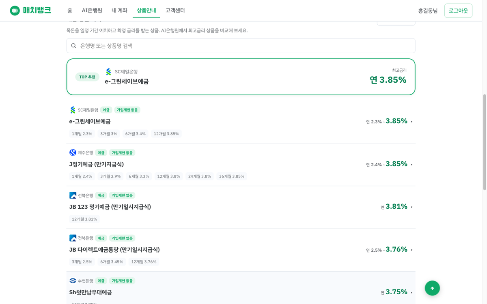
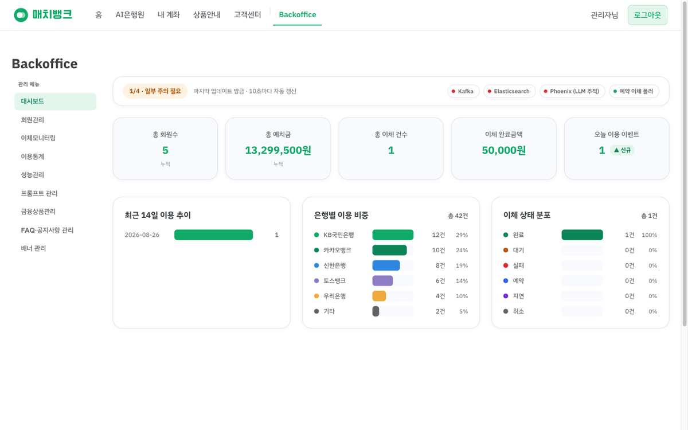
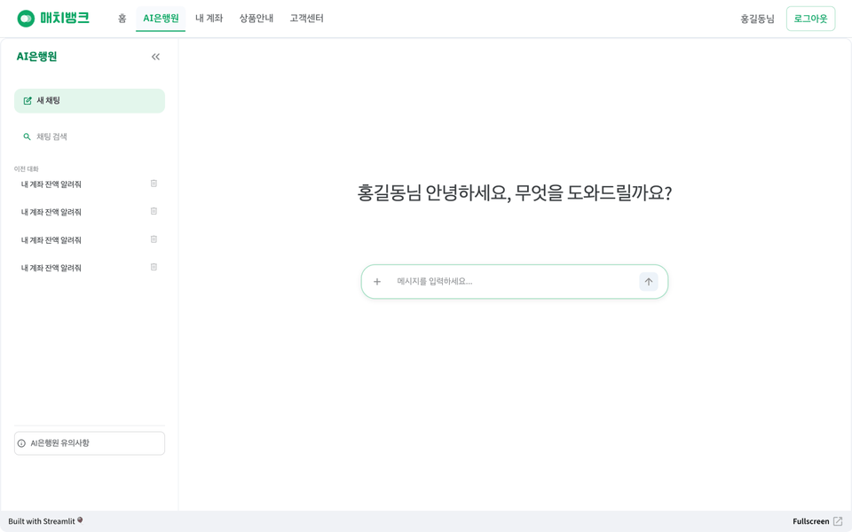
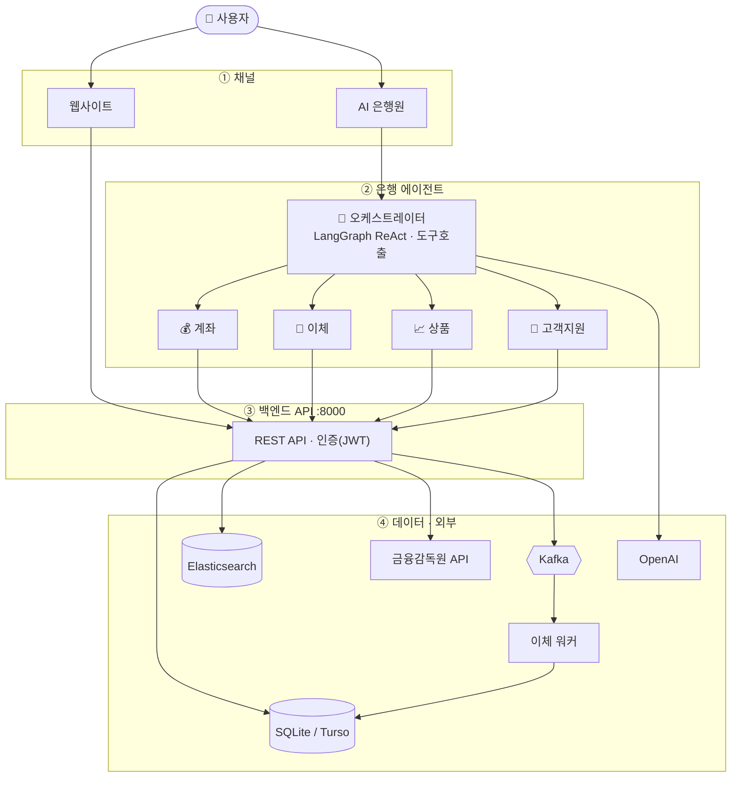

# 매치뱅크 (MatchBank)

**대화만으로 계좌조회·상품비교·이체까지 처리하는 AI 은행원**


---

## 이게 무슨 서비스인가

매치뱅크는 은행 웹사이트에 **"AI 은행원"** 을 심어, 사용자가 대화만으로 실제 은행 업무를 처리할 수 있게 만든 데모 서비스입니다. 질문에 답만 하는 챗봇이 아니라, AI가 계좌 조회·상품 비교·이체 신청을 **직접 수행**하고 그 결과를 사용자가 확인·승인하는 구조로 설계했습니다.

**왜 만들었나 — 세 가지 문제**

시중의 은행 챗봇 대부분은 자주 묻는 질문에 답하는 안내판에 머물러 있습니다. 계좌를 보려면, 이체를 하려면 결국 사람이 메뉴를 눌러가며 처리해야 합니다. 둘째로 예금·대출 상품을 비교하려면 은행마다 앱을 켜고 금리를 하나씩 확인해야 하는데, 전세자금대출이나 신용대출처럼 은행별 조건 차이가 큰 상품일수록 번거로움이 커집니다. 셋째로 대부분의 AI 챗봇은 **만들고 나면 운영할 방법이 없습니다.** 답변이 이상해도 원인을 볼 수 없고, 프롬프트를 바꾸려면 코드를 다시 배포해야 합니다.

이 세 가지를 함께 풀려고 시작했습니다. 그래서 이름도 "AI 챗봇"이 아니라 **"AI 은행원"** 입니다.

**누구를 위한 것인가**

- **금융 소비자** — 여러 은행 앱을 오가며 금리를 비교하는 게 번거롭고, 안내를 넘어 계좌 조회나 이체까지 AI가 대신 처리해주길 원하는 사용자
- **AI를 운영해야 하는 담당자** — 이런 AI 은행원을 서비스에 도입하려는 기획자·운영자. 배포 후에도 프롬프트를 실험(A/B)하고 모델을 바꿔가며 운영해야 하는 실무자에게 백오피스가 그대로 필요한 도구가 됩니다

---

## 🔗 라이브 데모

### **https://bankservice-six.vercel.app**

바로 로그인해서 써보실 수 있습니다.

| 구분 | 아이디 | 비밀번호 | 이체 비밀번호 | 볼 수 있는 것 |
|---|---|---|---|---|
| **일반 사용자** | `demo` | `demo1234` | `246810` | AI은행원 · 계좌조회 · 이체 · 상품안내 · 마이페이지 · 고객센터 |
| **관리자** | `admin` | `admin1234` | `135790` | 위 전부 + **백오피스 9개 메뉴** |

> **데모 환경입니다.** 계좌·거래·회원 정보는 전부 `seed_bank.py`가 만든 가짜 데이터이며 실제 금융거래는 일어나지 않습니다. 공개 계정이라 여러 사람이 함께 쓰기 때문에, 데이터가 망가지지 않도록 **백오피스는 조회 전용**으로 동작하고 AI 은행원에는 일일 체험 한도가 걸려 있습니다. AI 은행원은 별도 서버에서 동작해 12시간 이상 접속이 없으면 절전되며, 그 경우 첫 접속에 30초쯤 기동 시간이 걸릴 수 있습니다.

---

## 화면

| 홈 | AI 은행원 |
|---|---|
|  |  |

| 상품안내 (금융감독원 실시간 데이터) | 백오피스 대시보드 |
|---|---|
|  |  |

---

## AI 은행원은 어떻게 동작하는가



LangGraph의 **ReAct 에이전트**로 구현했습니다(`agent.py`). 사용자의 요청을 이해하고 → 필요한 도구를 스스로 골라 호출하고 → 결과를 확인한 뒤 → 다음 행동을 정하는 과정을 목표를 달성할 때까지 반복합니다. "질문 하나에 답변 하나"로 끝나는 일반 챗봇과의 핵심 차이입니다.

**에이전트가 가진 도구 9개**

| 도메인 | 도구 | 하는 일 |
|---|---|---|
| 계좌 | `get_accounts` | 내 모든 계좌와 잔액 조회 |
| | `get_transactions` | 계좌번호로 거래내역 조회 |
| 이체 | `lookup_recipient` | 받는 계좌의 예금주·은행·예상 수수료 확인 |
| | `propose_transfer` | **이체를 '제안'만 함 (실행하지 않음)** |
| 상품 | `search_products` | 금융감독원 실시간 상품 조회·비교 |
| 고객지원 | `get_faqs` / `get_notices` / `get_documents` | FAQ·공지·서식 검색 |
| | `create_inquiry` | 1:1 문의 접수 |

### 🔒 이체 실행 권한을 LLM에서 분리한 설계

이 프로젝트에서 가장 신경 쓴 부분입니다. **LLM에게는 이체를 실행할 수단 자체를 주지 않습니다.**

```
사용자: "김철수한테 5만원 보내줘"
   ↓
LLM  : propose_transfer 호출 → 예금주·수수료 확인한 '제안'만 반환
   ↓
UI   : 확인 카드 렌더 (예금주 · 금액 · 신규 수취계좌 경고 · 이체 시점)
   ↓
사람 : 체크박스 확인 + 이체 비밀번호 6자리 입력
   ↓
그제야 execute_transfer → POST /api/transfer 실행
```

`execute_transfer`는 **LLM이 호출할 수 있는 도구 목록에 아예 없습니다.** UI가 사용자 승인 후 직접 부르는 일반 함수입니다(`agent.py`). 모델이 잘못 판단하거나 프롬프트 주입을 당하더라도 돈이 움직이지 않는 구조입니다.

---

## 아키텍처



하나의 프로그램이 아니라 **여러 프로세스가 협력하는 구조**입니다.

| 프로세스 | 포트 | 역할 | 필수 |
|---|---|---|---|
| FastAPI 백엔드 | 8000 | 정적 사이트 서빙 + 은행 REST API (엔드포인트 88개) | **필수** |
| Streamlit 챗봇 | 8501 | AI 은행원 UI, 사이트에 iframe으로 임베드 | AI 은행원 사용 시 |
| 이체 워커 | — | Kafka 소비 → 잔액 차감·거래내역 기록 | Kafka 사용 시 |
| Kafka | 9092 | 이체 이벤트 큐 | 선택 |
| Elasticsearch | 9200 | RAG 색인 (BM25 + kNN 하이브리드) | 선택 |
| Redis / ChromaDB | 6379 / — | 시맨틱 캐시 L1 / L2 | 선택 |
| Phoenix | 6006 | OpenTelemetry 트레이스 수집 | 선택 |

**외부 서비스는 전부 없어도 앱이 죽지 않습니다.** 모두 lazy import + try/except로 감싸 연결이 안 되면 해당 기능만 비활성화됩니다.

---

## 기술적 의사결정

### 이체는 동기 API + 비동기 워커로 분리
`POST /api/transfer`는 검증만 하고 `pending` 상태로 기록한 뒤 Kafka에 발행하고 즉시 응답합니다. 실제 잔액 차감과 거래내역 기록은 `transfer_consumer.py`가 소비해서 처리합니다. 요청이 몰려도 순서대로 안정적으로 처리하기 위한 구조입니다. 다만 배포 환경에서는 Kafka 브로커를 상시 호스팅하지 못해 `KAFKA_DISABLED` 동기 폴백으로 동작합니다.

### 금융감독원 API의 상품군별 스키마 차이 흡수
예금·적금과 대출 3종은 `optionList` 스키마가 완전히 다릅니다. 예적금은 `intr_rate`/`intr_rate2`를 쓰지만 주택담보·전세자금대출은 `lend_rate_min`/`lend_rate_max`, 신용대출은 `crdt_grad_1~13`(신용점수 구간별 금리)를 씁니다. `fss_fetcher.py`가 카테고리별로 파싱을 분기합니다.

신용대출에는 함정이 하나 더 있습니다. `optionList`에 "대출금리" 외에 "기준금리"·"가산금리"·**"가감조정금리"** 가 섞여 들어옵니다. 필터링하지 않으면 가감조정금리 같은 작은 값이 최저금리로 잘못 집계됩니다. `crdt_lend_rate_type_nm == "대출금리"`인 행만 사용합니다.

### `(fin_co_no, fin_prdt_cd)` 복합키로 옵션 그룹핑
`fin_prdt_cd`(상품코드)는 은행마다 독립적으로 매기기 때문에, 서로 다른 은행이 우연히 같은 코드를 쓰는 경우가 **실제로 있습니다.** 상품코드만으로 매칭하면 다른 은행의 금리 옵션이 섞여 들어옵니다. 반드시 은행코드까지 포함한 복합키로 묶어야 합니다.

### 대출은 정렬 방향이 반대
`/api/products`는 예금·적금을 최고금리 내림차순으로, 대출을 최저금리 오름차순으로 정렬합니다. 대출은 금리가 낮을수록 유리하기 때문입니다. 에이전트의 `search_products` 응답에도 이 점을 `note`로 명시해 LLM이 "가장 좋은 상품"을 반대로 고르지 않게 합니다.

### 2계층 시맨틱 캐시
Redis(L1, 정확 일치) + ChromaDB(L2, 유사도 검색)로 이미 답한 적 있는 질문의 답변을 재사용합니다(`cache.py`). 히트 여부는 Phoenix 스팬 속성 `cache.hit`으로 기록합니다.

### 운영 가능한 AI — 코드 배포 없이 튜닝
시스템 프롬프트와 모델을 백오피스에서 바로 바꿀 수 있고, 변경 이력이 남아 **diff를 보고 이전 버전으로 롤백**할 수 있습니다. 저장하지 않고 현재 프롬프트와 편집 중인 프롬프트로 같은 질문을 **동시에 실행해 답변과 지연시간을 비교**하는 A/B 기능도 있습니다(`POST /api/admin/prompt-ab-test`). 사용자의 좋아요/싫어요 피드백은 사유별로 집계됩니다.

### SQLite ↔ Turso 겸용 DB 어댑터
로컬은 표준 `sqlite3`, 배포는 Turso(libSQL)를 씁니다. 그런데 libsql은 `row_factory`와 `executescript`를 구현하지 않아 그대로는 코드가 갈라집니다. `sqlite3.Row` 호환 래퍼를 만들어 흡수했고(`backend/db.py`), 덕분에 애플리케이션 코드는 양쪽에서 동일합니다. 스키마 마이그레이션도 `ALTER TABLE ADD COLUMN` 멱등 루프로 처리해 기존 DB가 그대로 따라옵니다.

---

## 주요 기능

**사용자**

| 화면 | 내용 |
|---|---|
| 홈 | 3D 히어로, 빠른 액션, 공지·이벤트·특별상품과 연동되는 배너 캐러셀 |
| AI 은행원 | 대화로 계좌조회·상품추천·이체, 답변 피드백(좋아요/싫어요 + 사유 선택), 파일 첨부 |
| 내 계좌 | 잔액·거래내역 조회, 3단계(입력→확인→완료) 이체 |
| 상품안내 | 5종 상품 실시간 비교, 카테고리별 인기 TOP5, 특별상품, 은행 공식 사이트 바로가기 |
| 마이페이지 | 내 정보, 보안(이체 비밀번호·이상행동 기록), 계좌 관리, 즐겨찾기, 예약이체, 문의내역, 거래명세서 |
| 고객센터 | 공지사항, FAQ, 이벤트(응모·추첨), 1:1 문의, 서식·약관 자료실 |

**백오피스 (관리자 전용)**

대시보드 · 회원관리 · 이체 모니터링 · 이용통계 · 성능관리(인프라 연동 현황, LLM/RAG 사용 지표) · **프롬프트 관리**(편집·버전 이력·롤백·A/B 비교·피드백 집계) · 금융상품 관리 · FAQ·공지사항·이벤트 관리 · 배너 관리

상세 기획은 [`docs/기획서.md`](docs/기획서.md)에 있습니다.

---

## 기술 스택

| 영역 | 사용 기술 |
|---|---|
| AI 에이전트 | LangGraph (ReAct), LangChain, OpenAI (gpt-4o-mini / gpt-4o / gpt-4.1-mini) |
| 백엔드 | FastAPI, Uvicorn, PyJWT, bcrypt |
| 데이터 | SQLite (로컬) / Turso libSQL (배포) — 18개 테이블 |
| 메시징 | Kafka (KRaft) |
| 검색·캐시 | Elasticsearch (BM25 + kNN 하이브리드 RAG), Redis, ChromaDB |
| 관측 | Arize Phoenix (OpenTelemetry) |
| 프런트엔드 | Vanilla JS SPA, Three.js, IBM Plex Sans KR |
| 챗봇 UI | Streamlit |
| 외부 연동 | 금융감독원 금융상품 통합 비교공시 API |
| 배포 | Vercel (사이트 + API), Streamlit Community Cloud (챗봇), Turso (DB) |

---

## 로컬 실행

Python **3.12** 전용입니다.

### 최소 실행 (AI 은행원 제외 전 기능)

```bash
python3.12 -m venv .venv          # 시스템 기본 python3 가 3.12 가 아니면 전체 경로로 지정
.venv/bin/pip install -r requirements.txt

# 데모 데이터 시드 — bank.db 는 .gitignore 대상이라 이 단계가 필수입니다
.venv/bin/python seed_bank.py      # 사용자·계좌·거래 (demo/demo1234, admin/admin1234)
.venv/bin/python seed_support.py   # 공지·FAQ·서식·이벤트·배너
.venv/bin/python seed_usage.py     # 이용 통계 이벤트

.venv/bin/uvicorn backend.app:app --port 8000
```

→ http://localhost:8000 접속. 백엔드가 정적 사이트까지 서빙하므로 별도 웹서버가 필요 없습니다.

### AI 은행원까지 실행

```bash
cp .streamlit/secrets.toml.example .streamlit/secrets.toml   # OPENAI_API_KEY 입력
.venv/bin/streamlit run app.py                                # 별도 터미널
```

상품안내를 로컬에서 보려면 [금융감독원 API 키](https://finlife.fss.or.kr)를 발급받아 `config.json`의 `fss_api_key`에 넣거나 `FSS_API_KEY` 환경변수로 지정합니다.

### 선택 인프라

```bash
./start_infra.sh                          # Kafka + Elasticsearch + Phoenix 일괄 기동
.venv/bin/python transfer_consumer.py     # 이체 워커 (Kafka 사용 시)
.venv/bin/python ingest_fss.py            # FSS 상품 → Elasticsearch 색인
```

없어도 앱은 정상 동작하며 해당 기능만 비활성화됩니다.

### 환경변수

| 변수 | 용도 |
|---|---|
| `OPENAI_API_KEY` / `FSS_API_KEY` | `config.json`에 값이 없을 때의 폴백 (배포 환경용) |
| `BACKEND_URL` | 챗봇이 호출할 백엔드 주소 (기본 `http://localhost:8000`) |
| `CHAT_BASE_URL` | 사이트가 임베드할 챗봇 주소 (기본 `http://localhost:8501`) |
| `TURSO_DATABASE_URL` / `TURSO_AUTH_TOKEN` | 설정 시 SQLite 대신 Turso 사용 |
| `KAFKA_DISABLED` | Kafka 없이 동기 처리 |
| `DEMO_READONLY` / `DEMO_PUBLIC` | 공개 데모 보호 (백오피스 쓰기 차단 / 챗봇 남용 상한) |

---

## 테스트 · 품질 검증

```bash
.venv/bin/pytest                # 14개 (RAG · 시맨틱 캐시 · FSS 파서)
.venv/bin/python batch_test.py  # 배치 품질 테스트 → batch_test_results.json
.venv/bin/python build_stats.py # 결과 집계 → site/data/stats.json (백오피스 성능관리에서 조회)
```

`batch_test.py`는 10개 카테고리 999문항을 **20건 동시**로 실행하면서 Phoenix로 트레이스를 남기고, 응답 성공률·지연과 함께 **정답 채점**(수학은 정답 문자열 exact 비교, 나머지는 LLM-as-judge)까지 수행합니다.

저장돼 있는 최근 실행 결과(gpt-4o-mini):

| 항목 | 값 |
|---|---|
| 문항 수 | 999 |
| 응답 성공률 | 100% |
| 평균 지연 | 1,234 ms |
| 중앙값 / p95 | 954 ms / 2,738 ms |

> 이 결과는 채점을 끄고(`--no-grade`) 실행한 것이라 **정확도 수치는 포함돼 있지 않습니다**(`graded: 0`). 채점 로직 자체는 `batch_test.py`에 구현돼 있습니다.

실사용자가 없는 데모 프로젝트이므로 "가입자 수" 같은 지표는 존재하지 않습니다. 대신 **답변 품질을 스스로 측정하고 개선할 수 있는 구조를 만든 것** 자체를 성과로 정의했습니다 — 배치 평가, 프롬프트 A/B 실측, 사용자 피드백 집계, 트레이스 기반 캐시 히트율 측정이 그 구조입니다.

---

## 프로젝트 구조

```
backend/            FastAPI REST API + 데이터 계층
  app.py            엔드포인트 88개 (인증·계좌·이체·상품·고객지원·백오피스)
  db.py             SQLite/libSQL 겸용 어댑터, 18개 테이블, 도메인 로직
  auth.py           JWT 발급·검증, 관리자 권한 가드
  kafka_io.py       이체 이벤트 발행 (+ Kafka 없을 때 동기 폴백)
  infra_metrics.py  인프라 연동 상태 수집

agent.py            LangGraph ReAct 에이전트 + 도구 9개
llm.py              LLM 제공자 추상화 (스트리밍)
rag.py              Elasticsearch 하이브리드 검색
cache.py            2계층 시맨틱 캐시
fss_fetcher.py      금융감독원 API 파싱 (카테고리별 스키마 분기)
app.py              Streamlit 챗봇 UI (이체 확인 카드·피드백·대화 저장)
transfer_consumer.py  Kafka 소비 → 이체 실제 처리

site/               정적 SPA (index.html + js/main.js + css/style.css)
tests/              pytest 14개
docs/               기획서 · 디자인 토큰 · 스크린샷
```

---

## 문서

| 문서 | 내용 |
|---|---|
| [`docs/기획서.md`](docs/기획서.md) | 문제 정의 · 타겟 · 차별점 · 정보구조 · 성공지표 |
| [`docs/tokens.md`](docs/tokens.md) | 디자인 토큰 (컬러·타이포·스페이싱·모션) |
| [`architecture.mmd`](architecture.mmd) | 시스템 구성도 (Mermaid) |
| [`CLAUDE.md`](CLAUDE.md) | 아키텍처 설명 및 개발 규칙 |
| [`session-log.md`](session-log.md) | 개발 과정 상세 기록 |
| [`backlog.md`](backlog.md) | 남은 작업 체크리스트 |

---

## 알려진 한계

- **Kafka 상시 호스팅 미해결** — 배포본은 `KAFKA_DISABLED` 동기 폴백으로 동작합니다. 큐 기반 처리는 로컬에서만 확인할 수 있습니다.
- **RAG·시맨틱 캐시는 로컬 전용** — Elasticsearch·Redis를 배포 환경에 두지 않아 라이브에서는 비활성 상태입니다.
- **백오피스 설정 저장이 배포 환경에서 불가** — `config.save()`가 파일 쓰기라 읽기 전용 파일시스템인 Vercel에서는 저장되지 않습니다. 조회 전용 데모 모드와 맞물려 실질적인 영향은 없지만, 실서비스라면 설정을 DB로 옮겨야 합니다.
- **간편로그인은 UI만** — 카카오/네이버/구글 버튼은 화면만 구현돼 있고 OAuth 실연동은 미착수입니다.
- **JWT 시크릿이 소스에 하드코딩** — `backend/auth.py`에 데모용 고정값이 들어 있습니다. 실서비스 전 환경변수로 분리해야 합니다.
- **이체 응답이 느림** — 배포 환경에서 이체 계열 요청은 약 10초가 걸립니다(Vercel 콜드 스타트 + Turso 연결 비용). 로컬에서는 1초 미만입니다.

---

<sub>데이터 출처: 금융감독원 금융상품 통합 비교공시 · 포트폴리오 목적의 데모 프로젝트입니다.</sub>
